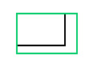
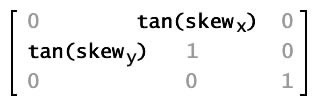

# Transformation Matrixes

A transformation matrix object is a 3 x 3 matrix with the following contents:

In traditional transformation matrixes, the u, v, and w properties provide extra capabilities. The Matrix class can only operate in two-dimensional space, so it always assumes that the property values u and v are 0.0, and that the property value w is 1.0. This doesn't need to be changed.

| Transformation | Method | Matrix values | Display result | Description |
| --- | --- | --- | --- | --- |
| Translation (displacement) | `tx, ty` |  |  | Moves the image `tx` pixels to the right and `ty` pixels down. |
| Scaling | `a, c` |  |  | Resizes the image, multiplying the location of each pixel by `sx` on the _x_ axis and `sy` on the _y_ axis. |
| Rotation | `a, b, c, d` |  |  | Rotates the image by an angle `q`, which is measured in radians. |
| Skewing or shearing | b, c |  |  | Progressively slides the image in a direction parallel to the _x_ or _y_ axis. The `b` property of the Matrix object represents the tangent of the skew angle along the _y_ axis; the `c` property of the Matrix object represents the tangent of the skew angle along the _x_ axis. |

Each transformation function alters the current matrix properties so that you can effectively combine multiple transformations. To do this, you call more than one transformation function before applying the matrix to its object target.
